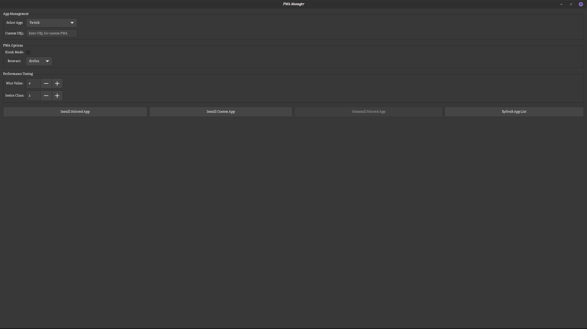

# PWA Manager


PWA Manager is a GTK-based desktop application for Linux that allows you to easily install, manage, and run Progressive Web Apps (PWAs) in dedicated browser profiles. It supports major browsers including **Firefox, Chrome, Chromium, Brave, Edge, and Opera**, with a true PWA experience, hiding the browser UI and tabs.

GitHub Repository: [https://github.com/bobbycomet/Pwa-manager](https://github.com/bobbycomet/Pwa-manager)


## Features

- Install and manage PWAs with isolated browser profiles.
- Full-screen or kiosk mode (console-like) for a native app-like experience.
- Hides browser UI and tabs for Edge and Chromium-based browsers.
- Add custom apps with URLs.
- Performance tuning via `nice` and `ionice` values.
- Works with multiple Linux distributions (supports `.deb` packaging).
- Automatic desktop entry creation with proper icons.





## Installation

### Using the `.deb` package

Download the latest `.deb` from the releases and install:

```
sudo dpkg -i pwa-manager.deb
sudo apt-get install -f  # Fix dependencies if needed
```

## Dependencies
```
sudo apt install python3-gi python3-gi-cairo gir1.2-gtk-3.0 wget curl
```

```
# Download the GPG key
wget -qO- https://github.com/bobbycomet/Pwa-manager/raw/main/repo/public.key | sudo gpg --dearmor -o /usr/share/keyrings/pwa-manager-archive-keyring.gpg
```

```
echo "deb [signed-by=/usr/share/keyrings/pwa-manager-archive-keyring.gpg] https://github.com/bobbycomet/Pwa-manager/raw/main/apt/ stable main" | sudo tee /etc/apt/sources.list.d/pwa-manager.list
sudo apt update
```

```
sudo apt update
sudo apt install pwa-manager
```
